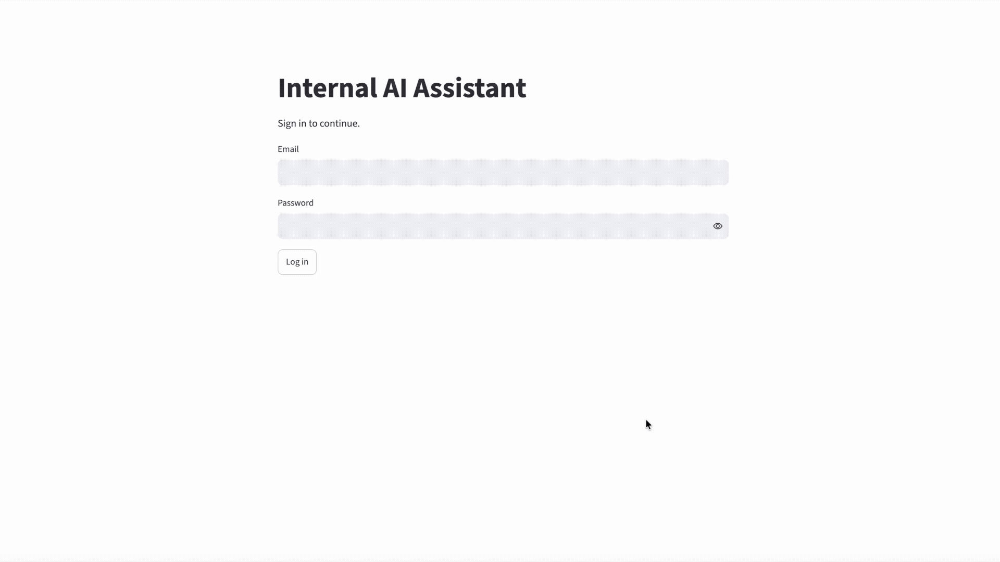

# Internal AI Assistant

This repository contains an internal AI assistant built with retrieval-augmented generation (RAG), persistent conversation memory, source-grounded citations, and role-based document access.

The system routes queries based on whether company context is required, retrieves authorized information from a vector database, and generates responses grounded in internal company documents. I also built an automated evaluation pipeline to measure retrieval quality, answer correctness, groundedness, citation reliability, permission enforcement, latency, and cost.

A primary motivation for this project was exploring how an internal AI assistant could maintain context beyond an individual user's conversations. In collaborative environments, useful knowledge is distributed across employees, teams, projects, and documents. Shared organizational memory could allow this context to persist and become available to other authorized users rather than remaining isolated within individual conversations.

The current architecture provides a foundation for this capability through persistent conversation storage, permission-aware retrieval, and role-based access controls. The same retrieval and authorization mechanisms could be extended to organization-wide, team, and project-level memory, with explicit access and privacy boundaries controlling which context can be shared.

For a detailed walkthrough of the system's development, design decisions, scaling challenges, and failure analysis, see [Development Process](docs/development_process.md).



### Tech Stack

- Python
- Streamlit
- Supabase (PostgreSQL, Auth, RLS)
- pgvector / HNSW
- Gemini API

---

## Architecture
The assistant uses a routed RAG architecture:

1. **Query routing** — Determines whether a request requires company-specific information and rewrites company-related questions into self-contained retrieval queries.
2. **Embedding** — Converts the retrieval query into a 768-dimensional embedding. 
3. **Permission-aware retrieval** — PostgreSQL and pgvector retrieve semantically similar document chunks using HNSW approximate nearest-neighbor search while filtering documents according to the user's role.
4. **Grounded generation** — Retrieved document chunks are passed to the LLM with numbered sources for citation.
5. **Conversation memory** — Recent messages are retained directly while older conversation history is periodically summarized.
6. **Observability** — Routing, retrieval, and generation are measured independently for latency, token usage, retries, and estimated API cost.

The full architecture is as follows: 


```text
DOCUMENT INGESTION
──────────────────

Company Documents
        ↓
 Text Extraction
        ↓
 Document Chunking
(250 words, 50 overlap)
        ↓
Gemini Embedding 2
(768D embeddings)
        ↓
┌──────────────────────────────┐
│Supabase / PostgreSQL Database│
│                              │
│    Documents + Chunks        │
│    pgvector + HNSW           │
│    Role-Based Permissions    │
└──────────────┬───────────────┘
               │
               │
               ↓
    ONLINE QUERY PIPELINE
    ─────────────────────

         User Message
               ↓
       Conversation Memory
   (recent messages + summary)
               ↓
           LLM Router
               │
    ┌──────────┴──────────┐
    │                     │
 GENERAL        COMPANY_CONTEXT_REQUIRED
    │                     │
    │                     
    │            Context-Aware Query
    │                  Rewrite
    │                     ↓
    │             Gemini Embedding 2
    │            (768-D Query Vector)
    │                     ↓
    │          Permission-Aware Vector
    │                   Search
    │                     ↓
    │               Top-K Similar Chunks
    │                     ↓
    │             Conversation Context
    │             + Retrieved Chunks
    │                     │
    └──────────┬──────────┘
               ↓
          Answering LLM
               ↓
        Grounded Response
       + Source Citations
```
---

## Key Features

### Permission-Aware RAG

Company documents are split into overlapping chunks and converted into 768-dimensional embeddings during ingestion. For company-specific queries, the user's question is rewritten into a self-contained retrieval query and embedded using the same embedding model. PostgreSQL/pgvector then uses vector similarity search with an HNSW index to retrieve the most semantically relevant document chunks.

Retrieval is permission-aware: documents are assigned `employee`, `manager`, `hr`, or `admin` access levels, and access restrictions are applied during retrieval so unauthorized documents are never passed to the LLM.

### Query Routing

Using an LLM call, each request is classified as either `GENERAL` or `COMPANY_CONTEXT_REQUIRED`. For company-specific follow-up questions, conversational context is used to rewrite ambiguous references into self-contained retrieval queries before embedding and vector search.

### Source-Grounded Citations

Retrieved documents are assigned numbered source identifiers. The model cites sources using identifiers such as `[1]` and `[2]`, which are mapped back to the original documents by the application. This prevents the model from generating arbitrary filenames, citing sources with long filenames, and simpilfies citation validation.

### Persistent Conversation Memory

Conversations and messages are stored in PostgreSQL. Recent messages are included directly in model context, while older messages are periodically summarized to prevent conversation history from growing indefinitely.

### Observability

The pipeline records metrics including:

- routing, embedding, vector search, retrieval, and generation latency
- input and output tokens
- retries and handled API errors
- estimated API cost

---

## Evaluation

I built a 50-case evaluation suite containing company-specific questions, permission-sensitive queries, and general-purpose requests. The evaluation measures the system at multiple stages rather than using final answer accuracy alone. Evaluation metrics include:

| Metric | Purpose                                                                        |
|---|--------------------------------------------------------------------------------|
| Router accuracy | Was the query routed correctly?                                                |
| Retrieval accuracy | Was the expected document retrieved within the production Top-K retrieval set? |
| Groundedness | Were company-specific claims supported by retrieved context?                   |
| Answer correctness | Did the final response answer the evaluation question?                         |
| Citation validity | Did cited sources actually come from retrieval?                                |
| Citation support | Did the cited documents support the associated claims?                         |
| Permission accuracy | Did retrieval respect the user's document permissions?                         |
| Median response latency | What was the median elapsed time between user query submission and response?   |

### 5,000-Document Evaluation

The current test corpus contains 5,000 documents and approximately 35,000 document chunks.

| Metric                  | Result |
|-------------------------|-------:|
| Router accuracy         |   100% |
| Retrieval accuracy      |    88% | 
| Answer correctness      |    88% |
| Groundedness            |   100% |
| Citation validity       |   100% |
| Citation support        |   100% |
| Permission accuracy     |   100% |
| Median response latency |  6.25s |

The 90% answer-correctness score should be interpreted with some caution. Manual review of failed cases identified limitations in the evaluation procedure, including highly specific questions and reference criteria that could produce false negatives. Other failures were caused by the required evidence not reaching the generator rather than the generator incorrectly reasoning over the evidence it received.  For this reason, I treat answer correctness as one part of the evaluation rather than a standalone measure of generation quality. The combination of retrieval recall, answer correctness, groundedness, and citation support gives a more complete picture of system behavior.

See **[Development Process](docs/development_process.md)** for complete evaluation methodology, case-level failure analysis, and limitations of the current evaluation procedure.

---

## Error Analysis

Manual review showed that failed evaluation cases fell into several distinct categories:

- **Document-level ranking failures** — the intended document was not retrieved within the top-10 results but appeared at larger retrieval depths.
- **Chunk-level ranking failures** — the correct document was retrieved, but the answer-bearing chunk ranked too low to reach the generator.
- **Candidate retrieval failures** — the required evidence was absent even from the larger retrieval candidate set.
- **Generation failures** — the correct evidence reached the LLM, but competing context caused the generator to select the wrong information.
- **Evaluation ambiguity** — some broad questions had multiple valid answers, while the evaluator expected one specific source or answer.

These distinctions are important because they point to different improvements. The full case-level analysis and potential improvements are documented in **[Detailed Evaluation & Error Analysis](docs/evaluation.md)**.

---
## Cost Comparison

To estimate operating costs under heavy usage, I modeled an organization with
100 employees, each making approximately 100 queries per workday across
22 workdays per month. This corresponds to approximately 220,000 queries per month.

| Solution | Pricing Model | Estimated Monthly Cost |
| --- | --- | ---: |
| Custom Assistant — Gemini 3.8 Flash | Usage-based API | ~$1,100 |
| Custom Assistant — GPT-5.6 Sol | Usage-based API | ~$5,500 |
| Custom Assistant — Claude Sonnet 5.5 | Usage-based API | ~$2,800 |
| Gemini Enterprise Business | Per-user subscription | ~$2,100+ |
| ChatGPT Business | Per-user subscription | ~$2,000 |
| Microsoft 365 Copilot Business | Per-user subscription | ~$2,100 |
| Glean | Enterprise contract | ~$4,000–7,500* |

\*Glean pricing is uncertain because contracts may include minimum
commitments and negotiated rates.*

*Pricing estimates as of October 2026.*

Custom assistant API costs were estimated using the token consumption measured during
the 5,000-document evaluation: approximately 4,345 input tokens and 366 output
tokens per query. These values were applied to each provider's API pricing and
scaled to 220,000 monthly queries.

The custom Gemini implementation also includes an estimated \$25–75 per month for Supabase
and \$25–85 per month for application hosting. The custom OpenAI and Claude estimates use
the same infrastructure assumptions, only the model API provider and associated
token costs are changed.

Enterprise costs are based on published per-user pricing where available. These
subscription prices are not necessarily complete estimates of an organization's
total software costs. For example, Microsoft 365 Copilot requires an eligible
Microsoft 365 subscription, while other platforms may incur additional charges for
higher usage, advanced reasoning, additional storage, or connected services.
Since organizations may already pay for products such as Microsoft 365 or Google
Workspace independently of their AI assistant, the table compares
the incremental cost of adopting each AI solution rather than attempting to estimate
the organization's entire software stack.

The comparison suggests that a custom architecture can reduce direct software costs,
particularly when using lower-cost models such as Gemini, but the advantage is not
universal. Managed enterprise platforms charge more while providing mature
integrations, administration, compliance tooling, support, and reduced maintenance
burden. A custom system is therefore most compelling when an organization values control,
customization, specialized workflows, or the ability to choose and change model
providers enough to justify owning and maintaining the underlying system.

---

## Future Work

The current system provides a measured baseline for future improvements. Rather than
adding additional complexity by default, future work will focus on limitations
identified through evaluation and latency analysis.

- investigate opportunities to reduce overall system latency, particularly routing and generation overhead 
- test reranking or hybrid retrieval against identified retrieval failures
- compare generation models on answer quality, latency, and cost
- improve frontend responsiveness or replace Streamlit if application latency becomes a priority
- explore richer long-term conversational memory if required by the use case
- explore organization-wide and project-level memory to improve context sharing across collaborative work

## Project Status

The core system is complete as an evaluated prototype. It implements permission-aware
RAG, persistent conversation memory, contextual query rewriting, grounded citations,
automated evaluation, scalable vector retrieval, and stage-level observability.

The system has been evaluated at up to 5,000 documents, with remaining work focused
on targeted experiments around retrieval quality, model and router selection,
latency, evaluation design, and production-level application infrastructure.